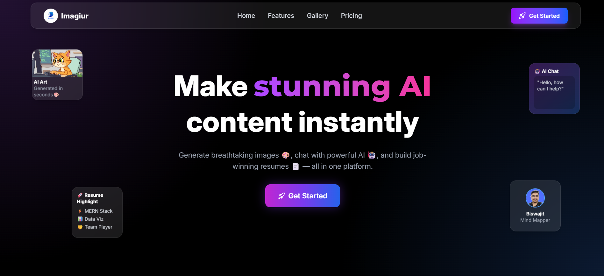
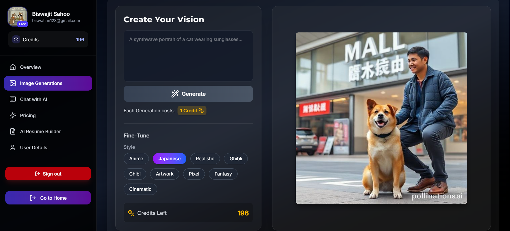
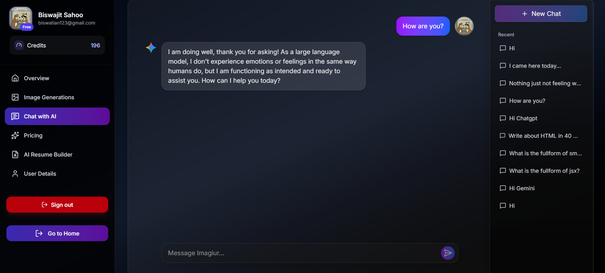
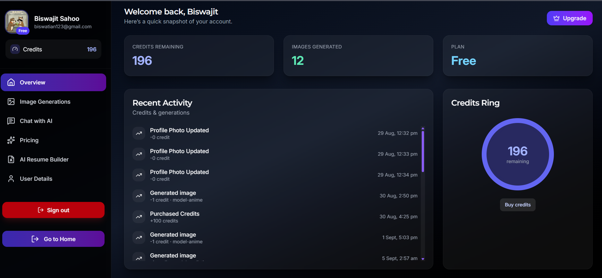

  
  
  
  
  
  


**Imagiur** is an all-in-one AI-powered platform that lets you **generate stunning images 🎨, chat with AI 🤖, and build resumes 📄** — all in one place.

## 📸 Preview

### 🏠 Homepage



### 🎨 Image Generator



### 🤖 AI Chat Assistant



### 📊 Dashboard



## ✨ Features

- 🎨 **AI Image Generation**

  - Powered by **Pollinations AI**.
  - Generate unique images from text prompts.
  - Each image costs **1 credit**.

- 🤖 **AI Chat Assistant**

  - Chat with an intelligent AI assistant built using **Gemini API**.
  - Retrieve **recent chats** anytime.

- 📄 **AI Resume Builder**

  - Fill in your details and generate a professional resume instantly.

- 👤 **User Authentication**

  - Create an account or sign in with **Google Auth**.
  - Update your profile details anytime.

- 💳 **Credit System**

  - Free plan comes with **10 credits**.
  - Buy additional credits inside the app.
  - Dashboard shows your **remaining credits, number of images generated, and history**.

- 📊 **User Dashboard**
  - View all your generated images.
  - Track usage and credits.
  - Manage personal details.

## 🛠️ Tech Stack

**Frontend**  
⚛️ React (Vite) • 🎨 Tailwind CSS

**Backend**  
🟢 Node.js • ⚡ Express

**Database & Auth**  
🔥 Firebase Firestore • 🔑 Firebase Authentication

**AI APIs**  
🖌️ Pollinations AI • 💬 Gemini API

## 🚀 Getting Started

### 1️⃣ Clone the repository

```bash
git clone https://github.com/your-username/imagiur-ai.git
```

### 2️⃣ Frontend Setup

```bash
cd frontend
npm install
```

Create a .env file inside frontend/

```bash
VITE_BACKEND_URL=http://localhost:5000
```

Run frontend:

```bash
npm run dev
```

### 3️⃣ Backend Setup

```bash
cd backend
npm install
```

Create a .env file inside backend/ with your Firebase and API credentials:

```bash
PORT=5000
FIREBASE_CREDENTIALS={"projectId":"...","clientEmail":"...","privateKey":"..."}
GEMINI_API_KEY=your_gemini_api_key
```

Run Backend:

```bash
node server.js
```

## 📂 Project Structure

```bash
imagiur/
│── frontend/
│── backend/
│── .gitignore
│── README.md

```

## 🎯 Roadmap

- Easily access profile
- Export resume as PDF
- Support for AI image generation
- Premium plans

## 🤝 Contributing

### Contributions are always welcome!

    1. Fork the repo 🍴
    2. Create feature branch 🌱 (`git checkout -b feature/my-feature`)
    3. Commit changes 📝(`git commit -m "Added new feature"`)
    4. Push branch 🚀(`git push origin feature/my-feature`)
    5. Open a PR 🎉

## 📜 License

### This project is licensed under the MIT License.

---

## 👨‍💻 Developer Info


### Hi 👋, I'm **Biswajit Sahoo**

🚀 Fullstack Developer | ⚡ Tech Explorer | 📊 Aspiring Data Analyst

### 🌟 About Me

- 💻 Passionate about building modern web apps with **React, Node.js, Express, Firebase**
- 🎨 Love experimenting with **AI + 3D Animations + Futuristic UI/UX**
- 🌱 Currently exploring **AI-powered tools, Data Analytics, and MERN Stack scaling**
- ☕ Survive on **coffee + late-night coding**
- 🎯 Goal: To create impactful projects blending **AI + Web Development**

### 📬 Connect With Me

- 📧 [Email](mailto:biswajitsahoo1424@gmail.com)
- 💼 [LinkedIn](https://www.linkedin.com/in/biswajit-sahoo3/)
- 🖥️ [GitHub](https://github.com/bisu2580)
- 🐦 [Twitter](https://twitter.com/sahoobiswajit13)

### 📊 GitHub Stats


### ⚡ Fun Tagline

> Because late-night coding + coffee + AI = 💥 magic!
